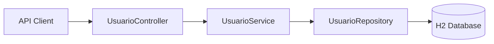

<div align="center">

# Crudify — Spring Boot User Management API

A compact REST API for user management built with **Java, Spring Boot, Spring Data JPA, and H2**, structured around a clear controller–service–repository architecture.

<p>
  
  
  
  
  
</p>

</div>

---

## Overview

**Crudify** is a backend project focused on the implementation of the core CRUD lifecycle for user data through a REST interface.

The application separates HTTP handling, business logic, and persistence responsibilities into dedicated layers, providing a simple example of layered backend design with Spring Boot.

### What the project demonstrates

- REST endpoint design with Spring Web;
- layered application organization;
- persistence with Spring Data JPA;
- derived repository queries;
- in-memory relational storage with H2;
- entity mapping with Jakarta Persistence;
- reduced boilerplate with Lombok;
- Maven-based build and dependency management.

---

## Architecture



```text
Usuario/
├── src/main/java/com/java/projetoUsuario/
│   ├── controller/       # HTTP endpoints
│   ├── service/          # Business logic
│   └── infra/
│       ├── entitys/      # JPA entities
│       └── repository/   # Data-access layer
├── src/main/resources/
│   └── application.properties
├── src/test/
└── pom.xml
```

---

## Technology Stack

| Layer | Technology |
|---|---|
| Language | Java 25 |
| Framework | Spring Boot 3.5.5 |
| Web | Spring Web |
| Persistence | Spring Data JPA |
| ORM / Mapping | Jakarta Persistence / Hibernate |
| Database | H2 in-memory database |
| Boilerplate reduction | Lombok |
| Build | Maven |
| Testing support | Spring Boot Test |

---

## Domain Model

The `Usuario` entity currently stores:

| Field | Description |
|---|---|
| `id` | Generated primary key |
| `email` | Unique and required email address |
| `nome` | Required user name |
| `senha` | Required password field |
| `ativo` | User active/inactive state |
| `dataCriacao` | Automatic creation timestamp |
| `dataAtualizacao` | Automatic update timestamp |

---

## REST API

Base path:

```text
/usuarios
```

| Method | Endpoint | Purpose |
|---|---|---|
| `POST` | `/usuarios` | Create a user |
| `GET` | `/usuarios?email={email}` | Find a user by email |
| `PUT` | `/usuarios?Id={id}` | Update a user by ID |
| `DELETE` | `/usuarios?email={email}` | Delete a user by email |

### Create a user

```bash
curl -X POST http://localhost:8081/usuarios \
  -H "Content-Type: application/json" \
  -d '{
    "email": "user@example.com",
    "nome": "Example User",
    "senha": "example-password",
    "ativo": true
  }'
```

### Find a user by email

```bash
curl "http://localhost:8081/usuarios?email=user@example.com"
```

### Update a user

```bash
curl -X PUT "http://localhost:8081/usuarios?Id=1" \
  -H "Content-Type: application/json" \
  -d '{
    "nome": "Updated User",
    "email": "updated@example.com"
  }'
```

### Delete a user

```bash
curl -X DELETE "http://localhost:8081/usuarios?email=updated@example.com"
```

---

## Running Locally

### Requirements

- Java 25
- Maven, or the included Maven Wrapper

### Clone the repository

```bash
git clone https://github.com/Dyogo199/crudify-spring-boot-api.git
cd crudify-spring-boot-api/Usuario
```

### Run with Maven Wrapper

Linux / macOS:

```bash
./mvnw spring-boot:run
```

Windows:

```powershell
.\mvnw.cmd spring-boot:run
```

The API will start at:

```text
http://localhost:8081
```

---

## H2 Console

The H2 web console is enabled at:

```text
http://localhost:8081/h2-console
```

Configured JDBC URL:

```text
jdbc:h2:mem:usurious
```

---

## Testing

Run the project test suite with:

```bash
./mvnw test
```

The repository currently includes Spring Boot test infrastructure and can be extended with controller, service, repository, and integration tests.

---

## Demonstration

<div align="center">
  
</div>

---

## Engineering Improvements

Potential next iterations for the project include:

- request/response DTOs instead of exposing persistence entities directly;
- Bean Validation for API input;
- centralized exception handling with `@ControllerAdvice`;
- password hashing and authentication with Spring Security;
- consistent HTTP status codes and error responses;
- broader automated test coverage;
- persistent PostgreSQL profile for production-like execution;
- OpenAPI / Swagger documentation;
- containerization with Docker;
- CI workflow for build and tests.

---

## Author

**Dyogo Mondego**  
MSc Student in Computer Science @ IME-USP · Software Engineer · Researcher in Empirical Software Engineering & AI

[LinkedIn](https://www.linkedin.com/in/dyogomondego/) · [GitHub](https://github.com/Dyogo199)
